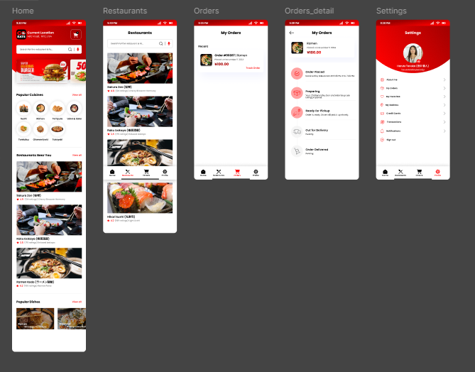

# :iphone: Fly Eats
A beautiful and functional mobile app built using **React Native** and **Expo**. This project showcases modern mobile app development with clean UI, smooth navigation, and responsive design.
---
## :sparkles: Features
- :closed_lock_with_key: User Authentication (Login / Register)
- :compass: Intuitive Navigation using React Navigation
- :art: Responsive and customizable UI
- :zap: Fast performance with Expo
- :camera: Media or Image Upload Support *(if applicable)*
- :globe_with_meridians: API Integration *(mention if any)*
---
## :camera_with_flash: Screenshots
Replace these image paths with your actual screenshots.
| Home Screen | Login Screen | Profile Screen |
|-------------|--------------|----------------|
|  |  |  |
---
## :rocket: Getting Started
### Prerequisites
Make sure you have the following installed:
- Node.js
- Expo CLI: `npm install -g expo-cli`
### Installation
```bash
git clone [https://github.com/yourusername/your-repo-name.git](https://github.com/Khuwaja-Umair/fly-eats.git)
cd your-repo-name
npm install

```bash
expo start


:heart: Support
If you like this project, please :star:️ the repository to support the developer.
